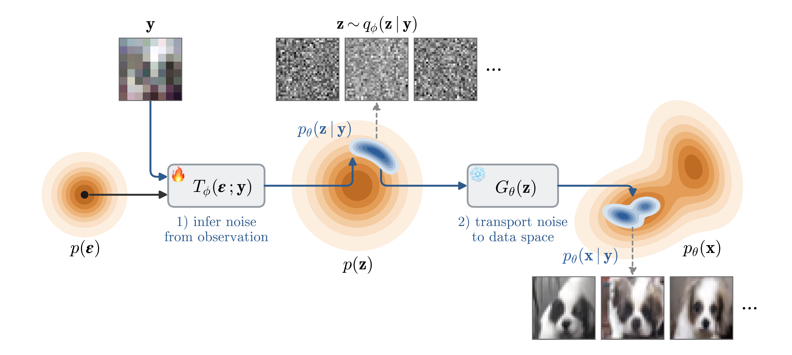

# NF-VFM

Conditional generation in a single step of a pretrained flow map, without fine-tuning it.

A flow map can generate data from noise in a single network evaluation. 
Following Variational Flow Maps (VFM), this project solves conditional generation directly in the input noise space of a flow map: a small network, the noise adapter,
predicts a distribution over the noise that the flow map sends to samples satisfying the
condition. VFM uses a Gaussian adapter, and jointly trains it with the flow map. NF-VFM replaces the
Gaussian with a normalising flow, and leaves the pretrained flow map frozen. 

This project focuses on inverse problems, where an unknown image `x` is observed through a
known operator that discards information, giving `y = A(x) + noise`. The operator may
downsample, mask or blur, so many images are consistent with the same observation, and the
task is to sample the posterior over `x`.

## Layout

| folder | contents |
|---|---|
| `checkerboard/` | the two-dimensional checkerboard problem, as notebooks |
| `cifar/` | the CIFAR-10 experiments: brightness steering, super-resolution and inpainting |

Each folder has its own README describing the files inside it.

## Setting up

The CIFAR-10 scripts expect three things to sit inside `cifar/common/`:

- `py-meanflow/` supplies the flow map network and its CIFAR-10 checkpoint
- `ml-tarflow/` supplies the TarFlow model used as the noise adapter
- `cifar_data/` holds the CIFAR-10 dataset

The same directory receives their output: checkpoints, image grids and metrics files.

The checkerboard notebooks need the two pretrained two-dimensional flow maps from the VFM
authors' repository, `fm_model.pt` and `mf_model.pt`.

Python packages are listed in `requirements.txt`. Install torch and torchvision separately,
choosing the build that matches your CUDA version. One of the listed packages, zuko, provides
the normalising flows used on the checkerboard problem. Logging to wandb is optional and is
turned off by setting `WANDB=0`.

